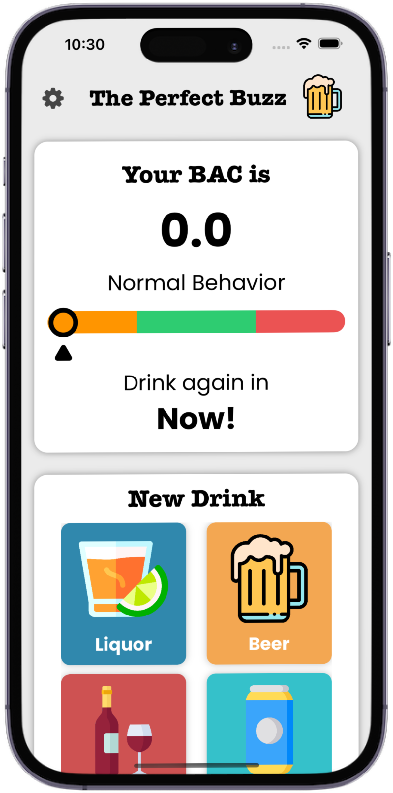
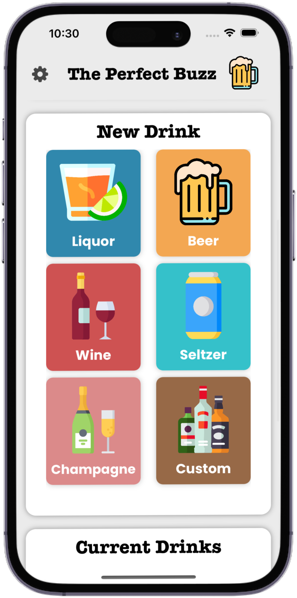
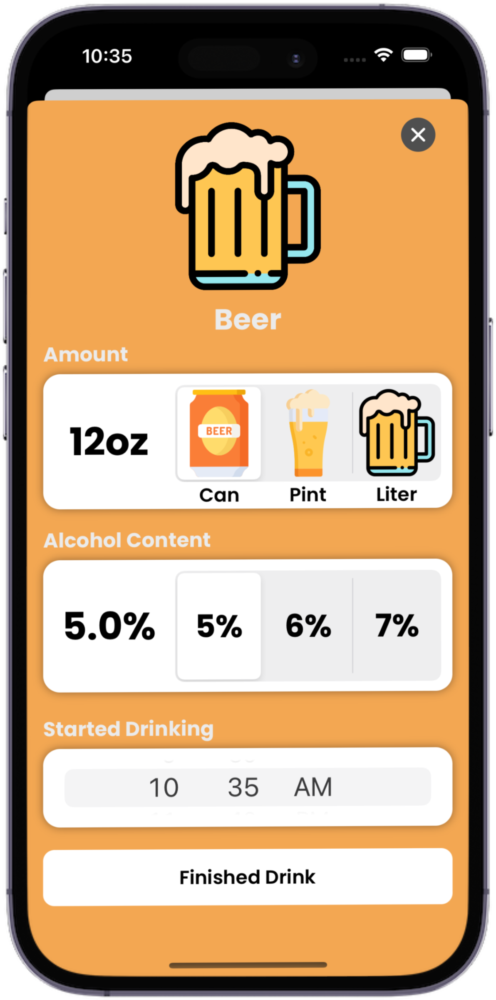
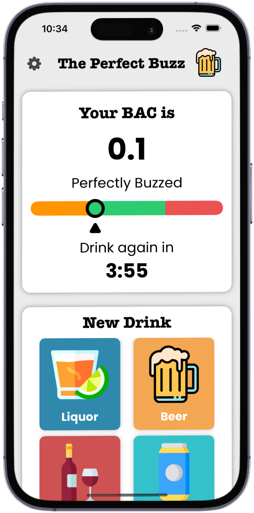
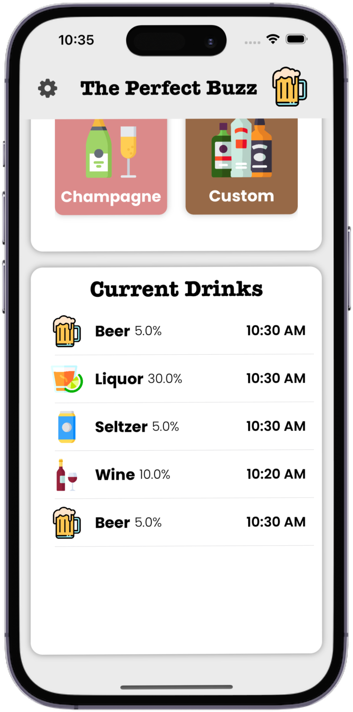

# The Perfect Buzz
## _iOS Application that tracks a user's BAC Level while drinking to help them achieve the perfect buzz_

## Main Features
- A user inputs the time they finished a drink, the volume of the drink, and its alcohol percentage
- The app updates in live time the user's BAC level based on their height, weight, drinking frequency, and gender
- Keeps track of every drink you have had, tells the user the expected outcome of their BAC level (slurred speech, happy, vision impaired etc.)
- Notifies the user when they should have another drink to maintain a perfect buzz level

## Screenshots

